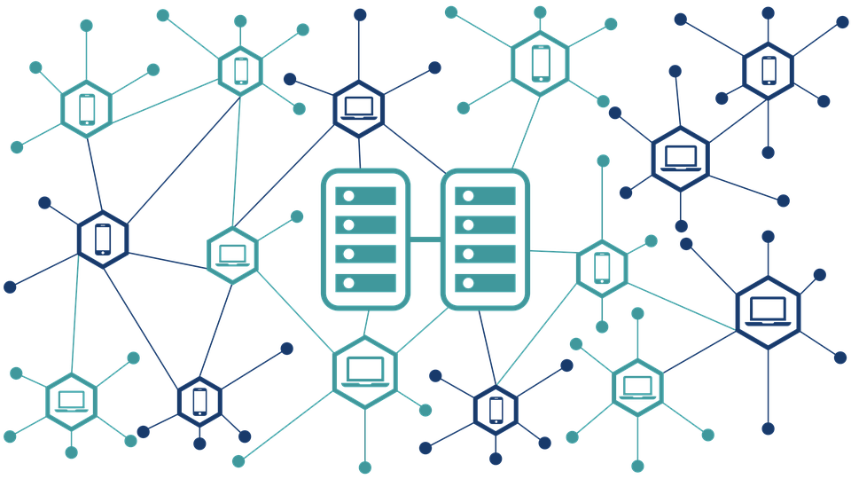

    
    </a>
    
    </a>

<!-- PROJECT LOGO -->

  

  <h3 align="center">블록체인 연수</h3>

  

    블록체인 이해와 구조
  

Date
----

-	**날짜 : 2020.6.13~6.27**
-	**강의시간 : 24h**  

Contents
--------

-	[블록체인의 이해]()
-	[블록체인의 작동원리]()
-	[이더리움과 하이퍼레저]()

Author
------

-	**Lunight**
-	Github: [@Lunight](https://github.com/LunightLab)
-	Email: [kimkshahaha@gmail.com](kimkshahaha@gmail.com)

Written by <a href="https://github.com/LunightLab">@Lunight</a><small></small>

